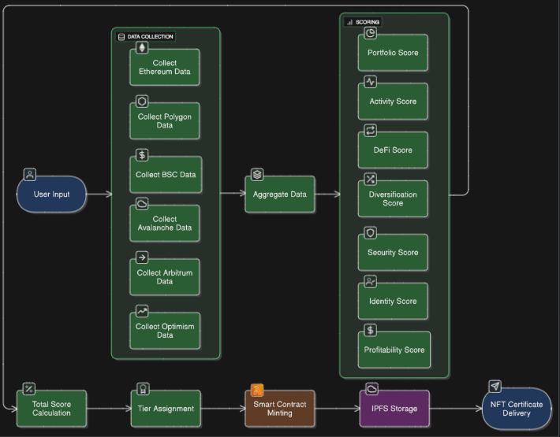

# 🏆 OnChain Score NFT Certificate System

> **Decentralized Multi-Chain Credit Scoring with Dynamic NFT Certificates**

Analyzes wallet activity across 6 blockchain networks, calculates OnChain credit scores using a 7-component algorithm, and mints NFT certificates with custom tier badges.



## 📸 Platform Screenshots

### Main Interface


### Analysis Progress


### Score Breakdown


### Tier Assignment


### NFT Certificate


## 🚀 Quick Setup

### 1. Install Dependencies
```bash
# Clone repository
git clone https://github.com/bharathbabu3017/onchain-score-backend.git
cd onchain-score-backend

# Install backend dependencies
npm install

# Install frontend dependencies
cd react-frontend
npm install
cd ..
```

### 2. Environment Configuration
Create `.env` file in root directory:

```bash
# Required: Moralis API Key
MORALIS_API_KEY=your_moralis_api_key_here

# Required: Wallet Private Key for NFT Minting
PRIVATE_KEY=your_private_key_here

# Optional: Server Configuration
PORT=9000
CACHE_TTL_SECONDS=600
```

### 3. Run Application
```bash
# Terminal 1 - Start Backend (port 9000)
node real-server.js

# Terminal 2 - Start Frontend (port 3005)
cd react-frontend
npm run dev
```

### 4. Access Application
- **Frontend**: http://localhost:3005
- **Backend API**: http://localhost:9000

## ✨ Features

- **Multi-Chain Analysis**: Ethereum, Polygon, BSC, Avalanche, Arbitrum, Optimism
- **7-Component Scoring**: Portfolio, Activity, DeFi, Diversification, Security, Identity, Profitability
- **Dynamic Tier System**: S+ to F tiers with custom colored badges
- **NFT Certificates**: ERC721 tokens with IPFS metadata
- **Modern UI**: React + TypeScript with glassmorphism design

## 🛠 Tech Stack

- **Frontend**: React 18, TypeScript, Vite, Tailwind CSS
- **Backend**: Node.js, Express, Ethers.js, Moralis API
- **Blockchain**: Solidity, Foundry, OpenZeppelin, Sepolia Testnet
- **Storage**: IPFS, Pinata Gateway

## 🔧 API Usage

```bash
# Calculate Score
curl -X POST http://localhost:9000/api/calculate-onchain-score \
  -H "Content-Type: application/json" \
  -d '{"walletAddress": "vitalik.eth", "chains": ["eth", "polygon"]}'

# Mint Certificate
curl -X POST http://localhost:9000/api/mint-certificate \
  -H "Content-Type: application/json" \
  -d '{"walletAddress": "0x1234...", "score": 85, "breakdown": {...}}'
```

## 🏅 Tier System

| Tier | Score | Badge Color |
|------|-------|-------------|
| S+ | 90-100 | Diamond |
| S | 80-89 | Gold |
| A+ | 70-79 | Rose Gold |
| A | 60-69 | Silver |
| B+ | 50-59 | Bronze |
| B | 40-49 | Purple |
| C+ | 30-39 | Blue |
| C | 20-29 | Green |
| D | 10-19 | Orange |
| F | 0-9 | Gray |

## 📝 License

MIT License - see [LICENSE](LICENSE) file for details.
